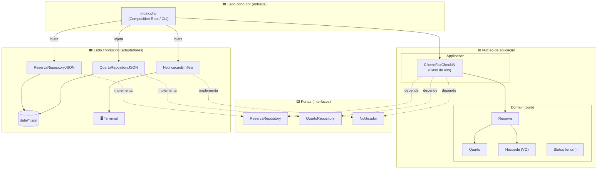
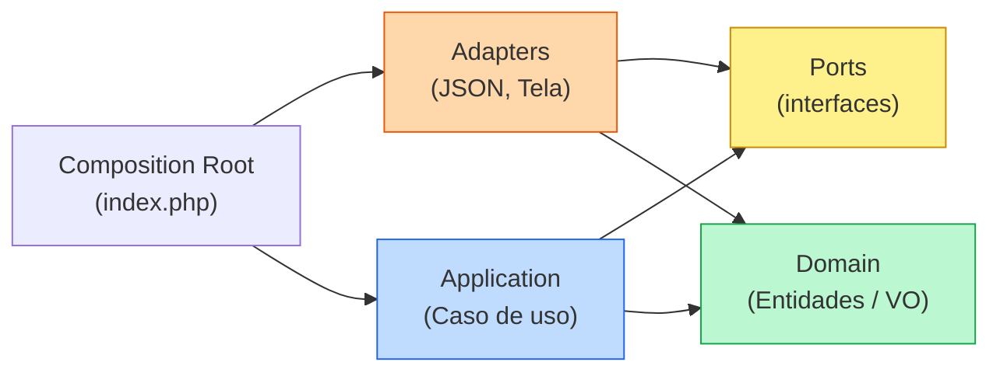
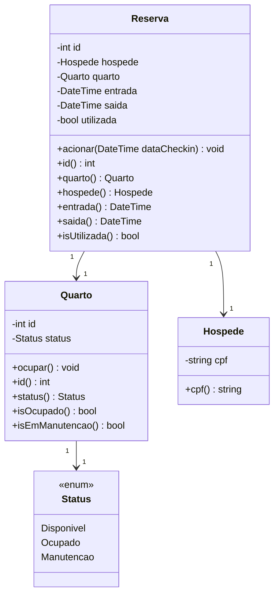
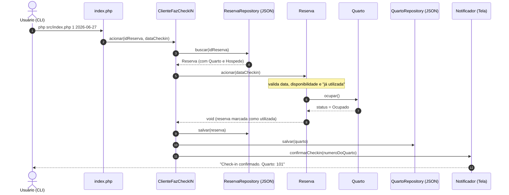

# 🏨 Hotel Check-in — Arquitetura Hexagonal

> Projeto de estudo que implementa o **check-in de hóspedes em um hotel** aplicando **Arquitetura Hexagonal** (Ports & Adapters) em PHP, com domínio puro, casos de uso, portas, adaptadores de persistência em JSON e cobertura de testes com **Pest**.

---

## 📑 Sumário

- [Sobre o projeto](#-sobre-o-projeto)
- [Regras de negócio](#-regras-de-negócio)
- [Arquitetura](#-arquitetura)
  - [Visão hexagonal](#visão-hexagonal)
  - [Fluxo de dependências](#fluxo-de-dependências)
- [Estrutura de diretórios](#-estrutura-de-diretórios)
- [Modelo de domínio](#-modelo-de-domínio)
- [Fluxo do check-in](#-fluxo-do-check-in)
- [Tecnologias](#-tecnologias)
- [Como executar](#-como-executar)
- [Como rodar os testes](#-como-rodar-os-testes)
- [Decisões de design](#-decisões-de-design)

---

## 🎯 Sobre o projeto

Um hotel gerencia **quartos** e **reservas**. Quando o hóspede chega, é feito o **check-in**. O objetivo do exercício é modelar esse fluxo isolando as **regras de negócio** (domínio) de qualquer detalhe técnico (persistência em arquivo, notificação em tela, entrada via linha de comando), de forma que **a tecnologia seja substituível sem tocar no núcleo**.

O coração da aplicação não sabe que os dados vêm de um JSON nem que a confirmação aparece no terminal — ele conversa apenas com **abstrações** (portas).

---

## 📋 Regras de negócio

1. Um **quarto** tem um status: `Disponível`, `Ocupado` ou `Em manutenção`.
2. Uma **reserva** é feita para um hóspede, em um quarto, com data de entrada e data de saída.
3. O check-in só pode ser feito **a partir da data de entrada** da reserva (não pode antes).
4. O check-in **não pode** ser feito se o quarto **não estiver disponível**.
5. O check-in **não pode** ser feito se a reserva **já tiver sido utilizada** (sem check-in duplo).
6. No check-in com sucesso: o quarto passa a **Ocupado**, a reserva é marcada como **utilizada** e o hóspede **recebe uma confirmação** com o número do quarto.

Cada violação dessas regras é representada por uma **exceção de domínio** dedicada.

---

## 🏛 Arquitetura

O projeto segue a **Arquitetura Hexagonal (Ports & Adapters)**. A ideia central:

- O **domínio** e a **aplicação** ficam no centro, sem dependências de infraestrutura.
- As **portas** (`interfaces`) definem *o que* o núcleo precisa do mundo externo.
- Os **adaptadores** implementam *como* isso é feito (JSON, tela, CLI) e podem ser trocados livremente.

> A regra de ouro: **as dependências apontam para dentro**. O domínio não conhece ninguém; quem conhece o domínio são as camadas externas.

### Visão hexagonal



### Fluxo de dependências

As setas mostram **quem depende de quem** — note que tudo aponta para o centro:



---

## 📂 Estrutura de diretórios

```
src/
├── Domain/                     # Núcleo: regras de negócio puras
│   ├── Quarto.php              # Entidade: quarto e seu estado
│   ├── Reserva.php             # Entidade: reserva e o check-in (acionar)
│   ├── Enum/
│   │   └── Status.php          # D = Disponível, O = Ocupado, M = Manutenção
│   ├── VO/
│   │   ├── Hospede.php         # Value Object: hóspede + validação de CPF
│   │   └── Exception/
│   │       └── CpfInvalidoException.php
│   └── Exception/              # Exceções de regra de domínio
│       ├── DatasInvalidasException.php
│       ├── CheckinAntesDaEntradaException.php
│       ├── ReservaJaUtilizadaException.php
│       └── QuartoIndisponivelException.php
│
├── Port/                       # Portas (interfaces / contratos)
│   ├── ReservaRepository.php   # buscar / salvar reserva
│   ├── QuartoRepository.php    # buscar / salvar quarto
│   └── Notificador.php         # confirmarCheckin(numeroDoQuarto)
│
├── Application/                # Casos de uso (orquestração)
│   └── ClienteFazCheckIN.php
│
├── Adapter/                    # Adaptadores (implementações concretas)
│   ├── JSON/
│   │   ├── QuartoRepositoryJSON.php
│   │   └── ReservaRepositoryJSON.php
│   ├── NotificacaoEmTela.php   # Notificador que imprime no terminal
│   └── Exception/              # Exceções de infraestrutura
│       ├── ArquivoNaoEncontradoException.php
│       ├── QuartoNaoEncontradoException.php
│       └── ReservaNaoEncontradaException.php
│
└── index.php                   # Composition Root + entrada CLI

data/
├── quartos.json                # Massa de dados de quartos
└── reservas.json               # Massa de dados de reservas

tests/                          # Testes de unidade (Pest), espelhando src/
```

---

## 🧩 Modelo de domínio



**Comportamentos-chave:**

- `Reserva::acionar(dataCheckin)` → aplica as regras 3, 4 e 5; se passar, ocupa o quarto e marca a reserva como utilizada. Retorna `void` — **o domínio não decide texto de apresentação**.
- `Quarto::ocupar()` → só ocupa se o quarto estiver `Disponível`; caso contrário lança `QuartoIndisponivelException`.
- `Hospede` → valida o CPF (dígitos verificadores) e o armazena **normalizado** (somente dígitos).

---

## 🔄 Fluxo do check-in



Se qualquer regra for violada, uma **exceção** sobe pela pilha e o `index.php` a converte em mensagem amigável + `exit 1` (o hóspede **não** é notificado).

---

## 🛠 Tecnologias

| Recurso | Uso |
|---|---|
| **PHP 8** | Linguagem (enums, constructor property promotion, tipos) |
| **Composer** | Autoload PSR-4 (`Tavares\Hotel\ → src/`) |
| **Pest 3** | Framework de testes |
| **Docker** | Ambiente de execução (container `ARQUITETURA_HEXAGONAL`) |
| **JSON** | Persistência (massa de dados em `data/`) |

---

## ▶ Como executar

A aplicação roda dentro do container Docker **`ARQUITETURA_HEXAGONAL`**, no diretório `/var/www/html/HOTEL_CHECKIN`.

### Instalar dependências (primeira vez)

```bash
docker exec ARQUITETURA_HEXAGONAL sh -c "cd /var/www/html/HOTEL_CHECKIN && composer install"
```

### Executar um check-in via CLI

O ponto de entrada recebe **dois argumentos**: o `id da reserva` e a `data do check-in` (formato `Y-m-d`).

```bash
# dentro do container, no diretório do projeto:
php src/index.php <idReserva> <dataCheckin>

# exemplo (caminho feliz):
php src/index.php 1 2026-06-27
# → Notificação em Tela:
# →
# → Check-in confirmado. Quarto: 101
```

**Exemplos de caminhos de erro** (saem com mensagem amigável e `exit 1`):

```bash
php src/index.php 1 2026-06-26     # Erro: ...não pode ser feito antes da data de entrada.
php src/index.php 999 2026-06-27   # Erro: Reserva não encontrada para o id: 999
php src/index.php                  # Uso: php src/index.php <idReserva> <dataCheckin no formato Y-m-d>
```

> ⚠️ Rodar um check-in com sucesso **altera os arquivos** `data/*.json` (quarto vira `Ocupado`, reserva vira `utilizada`). Para repetir o teste, restaure os dados (ex.: `git checkout -- data/`).

---

## 🧪 Como rodar os testes

```bash
# todos os testes
docker exec ARQUITETURA_HEXAGONAL sh -c "cd /var/www/html/HOTEL_CHECKIN && ./vendor/bin/pest"

# um arquivo específico
docker exec ARQUITETURA_HEXAGONAL sh -c "cd /var/www/html/HOTEL_CHECKIN && ./vendor/bin/pest tests/Unit/Domain/ReservaTest.php"
```

A suíte cobre **todas as camadas**: domínio, caso de uso (com *fakes* das portas) e adaptadores JSON (com *backup/restore* dos arquivos de dados para não corromper a massa real).

---

## 🧠 Decisões de design

- **Domínio puro e sem apresentação:** `Reserva::acionar()` retorna `void`. A **mensagem** ao cliente é montada pela borda (`NotificacaoEmTela`) a partir de um dado cru (o número do quarto). Trocar o idioma ou o canal (SMS, e-mail) não toca na entidade.
- **Inversão de dependência:** o caso de uso e o `ReservaRepositoryJSON` dependem de **portas**, nunca de classes concretas. Os `new` das implementações vivem só no **composition root**.
- **Exceções por camada:** regras de negócio lançam exceções de **domínio** (`Domain/Exception`); falhas técnicas lançam exceções de **infraestrutura** (`Adapter/Exception`), evitando vazar detalhe de infra para o núcleo.
- **Value Object com invariante:** `Hospede` valida o CPF na construção e o guarda **normalizado** (forma canônica).
- **Comparações estritas:** o `Quarto` compara `Status` com `===`/`!==`.

---

<p align="center"><i>Desenvolvido como exercício de Arquitetura Hexagonal — Rodrigo Cesar Tavares Ferreira.</i></p>
